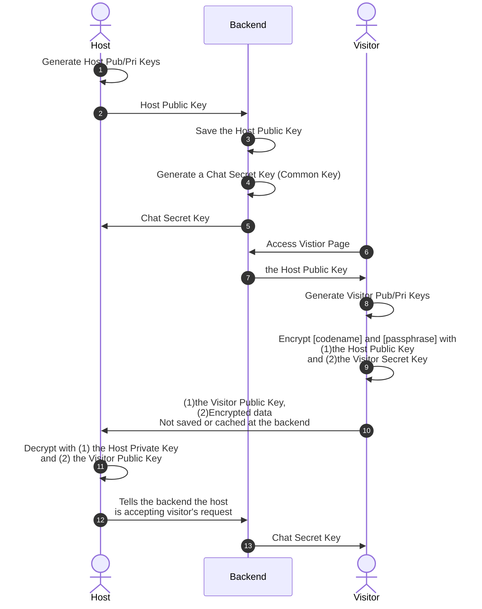

# SuzumeChat Frontend

**The documentation is still in progress!**
## Basic Usages

Before you start this frontend server, you need to start the SuzumeChat backend server.

```bash
# run the development server
yarn dev

# run unit tests
yarn test
```

## Key Exchange

Codename and passphrase are encrypted by public key encryption.
Chat messages are encrypted by secret key encryption.

Here is how they are exchanged in SuzumeChat.


